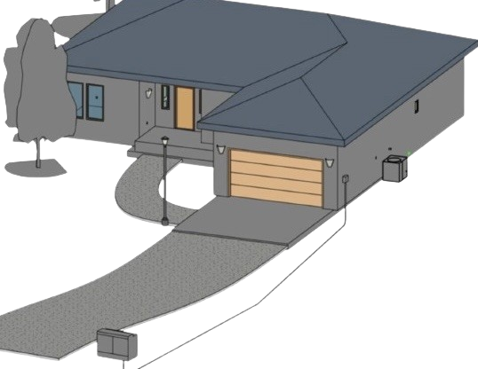

  

# Revit MEP Electrical House Model

Residential Revit MEP electrical model built by replicating the instructor’s workflow

## Features
- **Device layout:** receptacles, lighting fixtures, and switches (NEC-aware placement notes where applicable)
- Circuiting: assigned devices to panels and generated wiring
- Routing: junction boxes and conduit runs for coordination
- Distribution: panel schedules generated from modeled circuits
- Diagramming: one-line diagram
- Service context: meter base and utility transformer

## Documentation
- Electrical plan views with smart tags and standardized symbols
- Section views for visibility and coordination
- Cover sheet
- Electrical legend: symbols sheet and symbol list
- Sheet set including plans, panel schedules, one-line diagram, and legend
